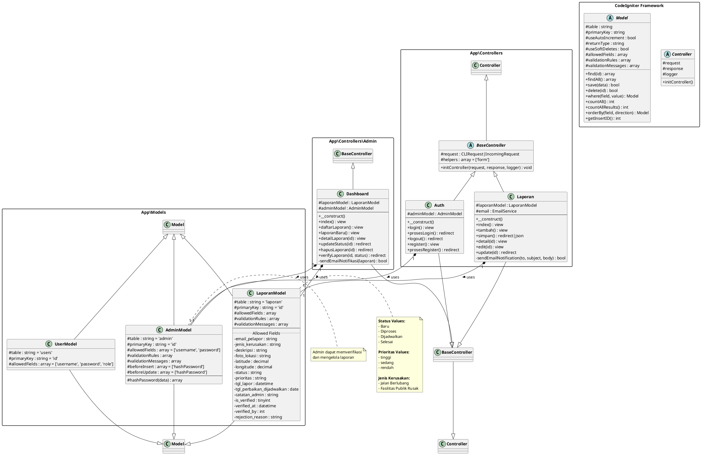

# Class Diagram - Sistem Pemetaan Laporan Fasilitas

## Diagram dalam Format PlantUML



---

## Diagram Versi Text (ASCII)

```
┌─────────────────────────────────────────────────────────────────────────────────────┐
│                        SISTEM PEMETAAN LAPORAN FASILITAS                            │
│                              CLASS DIAGRAM                                          │
└─────────────────────────────────────────────────────────────────────────────────────┘

                          ┌───────────────────────┐
                          │   <<abstract>>        │
                          │   CI4 Controller      │
                          ├───────────────────────┤
                          │ # request             │
                          │ # response            │
                          │ # logger              │
                          ├───────────────────────┤
                          │ + initController()    │
                          └───────────┬───────────┘
                                      │
                                      ▼
                          ┌───────────────────────┐
                          │   <<abstract>>        │
                          │   BaseController      │
                          ├───────────────────────┤
                          │ # request             │
                          │ # helpers = ['form']  │
                          ├───────────────────────┤
                          │ + initController()    │
                          └───────────┬───────────┘
                                      │
            ┌─────────────────────────┼─────────────────────────┐
            │                         │                         │
            ▼                         ▼                         ▼
┌───────────────────────┐ ┌───────────────────────┐ ┌───────────────────────────┐
│       Auth            │ │      Laporan          │ │   Admin\Dashboard         │
├───────────────────────┤ ├───────────────────────┤ ├───────────────────────────┤
│ # adminModel          │ │ # laporanModel        │ │ # laporanModel            │
│                       │ │ # email               │ │ # adminModel              │
├───────────────────────┤ ├───────────────────────┤ ├───────────────────────────┤
│ + login()             │ │ + index()             │ │ + index()                 │
│ + prosesLogin()       │ │ + tambah()            │ │ + daftarLaporan()         │
│ + logout()            │ │ + simpan()            │ │ + laporanBaru()           │
│ + register()          │ │ + detail()            │ │ + detailLaporan()         │
│ + prosesRegister()    │ │ + edit()              │ │ + updateStatus()          │
│                       │ │ + update()            │ │ + hapusLaporan()          │
│                       │ │ - sendEmailNotif()    │ │ + verifyLaporan()         │
│                       │ │                       │ │ - sendEmailNotifikasi()   │
└───────────┬───────────┘ └───────────┬───────────┘ └─────────────┬─────────────┘
            │                         │                           │
            │ uses                    │ uses                      │ uses
            ▼                         ▼                           ▼
┌───────────────────────┐ ┌───────────────────────┐ ┌───────────────────────────┐
│     AdminModel        │ │    LaporanModel       │ │      (Both Models)        │
└───────────────────────┘ └───────────────────────┘ └───────────────────────────┘


                          ┌───────────────────────┐
                          │   <<abstract>>        │
                          │     CI4 Model         │
                          ├───────────────────────┤
                          │ # table               │
                          │ # primaryKey          │
                          │ # allowedFields       │
                          │ # validationRules     │
                          ├───────────────────────┤
                          │ + find()              │
                          │ + findAll()           │
                          │ + save()              │
                          │ + delete()            │
                          │ + where()             │
                          │ + countAll()          │
                          └───────────┬───────────┘
                                      │
            ┌─────────────────────────┼─────────────────────────┐
            │                         │                         │
            ▼                         ▼                         ▼
┌───────────────────────┐ ┌───────────────────────┐ ┌───────────────────────┐
│     AdminModel        │ │    LaporanModel       │ │      UserModel        │
├───────────────────────┤ ├───────────────────────┤ ├───────────────────────┤
│ - table = 'admin'     │ │ - table = 'laporan'   │ │ - table = 'users'     │
│ - primaryKey = 'id'   │ │ - primaryKey = 'id'   │ │ - primaryKey = 'id'   │
├───────────────────────┤ ├───────────────────────┤ ├───────────────────────┤
│ Fields:               │ │ Fields:               │ │ Fields:               │
│ - username            │ │ - email_pelapor       │ │ - username            │
│ - password            │ │ - jenis_kerusakan     │ │ - password            │
├───────────────────────┤ │ - deskripsi           │ │ - role                │
│ Methods:              │ │ - foto_lokasi         │ └───────────────────────┘
│ # hashPassword()      │ │ - latitude            │
└───────────────────────┘ │ - longitude           │
                          │ - status              │
                          │ - prioritas           │
                          │ - tgl_lapor           │
                          │ - tgl_perbaikan_      │
                          │   dijadwalkan         │
                          │ - catatan_admin       │
                          │ - is_verified         │
                          │ - verified_at         │
                          │ - verified_by         │
                          │ - rejection_reason    │
                          └───────────────────────┘
```

---

## Deskripsi Class

### 1. Models (Layer Data)

| Class | Deskripsi | Table |
|-------|-----------|-------|
| **AdminModel** | Model untuk mengelola data admin/pengelola sistem | `admin` |
| **LaporanModel** | Model untuk mengelola data laporan fasilitas rusak | `laporan` |
| **UserModel** | Model untuk mengelola data pengguna umum | `users` |

### 2. Controllers (Layer Business Logic)

| Class | Deskripsi |
|-------|-----------|
| **BaseController** | Abstract controller dasar yang menyediakan fungsionalitas umum |
| **Auth** | Menangani autentikasi admin (login, logout, register) |
| **Laporan** | Menangani CRUD laporan dari sisi publik/guest |
| **Admin\Dashboard** | Menangani dashboard dan pengelolaan laporan oleh admin |

---

## Relasi Antar Class

### Inheritance (Pewarisan)
- `Auth` → `BaseController` → `Controller`
- `Laporan` → `BaseController` → `Controller`
- `Admin\Dashboard` → `BaseController` → `Controller`
- `AdminModel` → `Model`
- `LaporanModel` → `Model`
- `UserModel` → `Model`

### Association (Asosiasi)
- `Auth` menggunakan `AdminModel`
- `Laporan` menggunakan `LaporanModel`
- `Admin\Dashboard` menggunakan `LaporanModel` dan `AdminModel`

---

## Entity Relationship

```
┌─────────────┐         verifies          ┌─────────────┐
│    Admin    │ ────────────────────────► │   Laporan   │
│             │         manages           │             │
└─────────────┘                           └─────────────┘
      │                                         │
      │                                         │
      └───────── creates report ◄───────────────┘
                    (Guest/Public)
```

### Status Flow Laporan:
```
[Baru] ──► [Diproses] ──► [Dijadwalkan] ──► [Selesai]
   │            │                │
   └── [Ditolak/Rejected] ◄──────┴─── (jika tidak valid)
```

### Prioritas:
- **Tinggi** - Kerusakan urgent/berbahaya
- **Sedang** - Kerusakan perlu diperbaiki segera
- **Rendah** - Kerusakan dapat ditunda

---

## Cara Generate Diagram Visual

1. **Menggunakan PlantUML Online:**
   - Kunjungi https://www.plantuml.com/plantuml/uml
   - Copy-paste kode PlantUML di atas
   - Generate diagram

2. **VS Code Extension:**
   - Install extension "PlantUML"
   - Buka file ini dan preview diagram

3. **Command Line:**
   ```bash
   java -jar plantuml.jar CLASS_DIAGRAM.md
   ```
